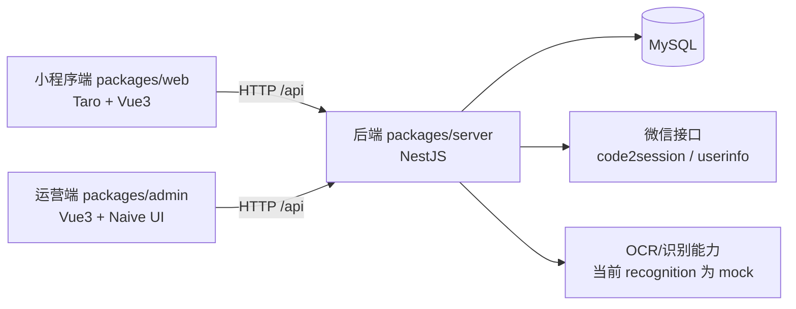
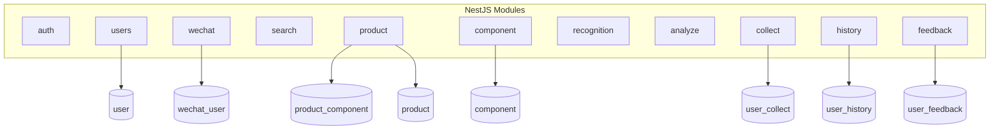

# 成分分析项目整体架构（Monorepo）

## 1. 文档目的

本文档用于统一说明当前仓库的整体架构，基于两部分信息整理：

- 产品侧交互需求：`成分分析小程序 MVP 产品需求文档（含交互逻辑·适配代码生成）.docx`
- 代码侧实际实现：`packages/web`、`packages/server`、`packages/admin`

同时纳入最新变更：**新增 `packages/admin` 作为运营端（后台管理端）前端工程**。

---

## 2. 项目结构概览

```text
chengfen/
├── docs/
│   └── 项目整体架构.md
├── packages/
│   ├── web/      # 小程序端（Taro + Vue3 + NutUI）
│   ├── server/   # 后端服务（NestJS + TypeORM + MySQL）
│   └── admin/    # 运营端（Vue3 + Vue Router + Naive UI）
├── docker-compose.yml
├── package.json
└── pnpm-workspace.yaml
```

`pnpm-workspace.yaml` 当前纳管 `packages/*`，三端统一在 monorepo 下维护。

---

## 3. 总体架构图



### 3.1 分层说明

- 接入层
  - `web`：面向 C 端用户的小程序/移动端页面
  - `admin`：面向运营人员的后台管理页面
- 服务层
  - `server`：统一 API、鉴权、业务编排、数据读写
- 数据层
  - MySQL + TypeORM 实体映射

---

## 4. 各子项目职责

## 4.1 `packages/web`（小程序端）

技术栈：Taro 4 + Vue3 + NutUI（跨端构建，当前页面按小程序交互设计）

核心页面（`src/app.config.ts`）：

- 首页：`/pages/index/index`
- 搜索结果：`/pages/search/result`
- 拍照识别：`/pages/recognition/index`
- 成分分析结果：`/pages/analyze/result`
- 产品详情：`/pages/product/detail`
- 成分详情：`/pages/component/detail`
- 我的：`/pages/mine/index`
- 收藏：`/pages/collect/index`
- 历史：`/pages/history/index`
- 反馈：`/pages/feedback/index`

前端请求约定：

- 统一请求封装：`src/utils/request.ts`
- 默认 API 前缀：`/api`
- token 存储：`token`，用户信息存储：`userInfo`

与 docx 的核心流程对齐情况：

- 登录授权：已实现 `ensureLogin` 逻辑（`Taro.login + getUserProfile + /auth/wechatLogin`）
- 搜索联想/查询：已实现（`/search/suggest`、`/search/query`）
- 扫码查商品：已实现（`/product/barcode`）
- OCR 成分识别：已实现调用入口（`/recognition/ocr`）
- 成分分析：已实现（`/analyze/components`）
- 收藏/历史/反馈：已实现接口接入（JWT 保护）

## 4.2 `packages/admin`（运营端）

技术栈：Vue3 + Vue Router + Naive UI + Lucide 图标

当前状态（代码现状）：

- 工程已接入 monorepo，并可独立启动/构建
- `main.ts` 已注册路由与 Naive UI
- 路由目前为基础骨架：`/`（Home）、`/about`（About）
- 业务页面（用户管理/产品库/反馈管理）尚未在前端页面层落地

定位：

- 作为运营管理入口，承接 docx 中后台能力：
  - 微信用户列表/详情
  - 产品库与成分库管理（增删改查）
  - 用户反馈处理

## 4.3 `packages/server`（后端服务）

技术栈：NestJS 10 + TypeORM + MySQL + JWT

全局约定：

- 全局前缀：`/api`（`main.ts`）
- 统一响应拦截：
  - 成功：`{ code: 0, data, message: 'success' }`
- 异常过滤：
  - 失败：`{ code: httpStatus, data: null, message }`
- CORS：已开启

---

## 5. 后端模块架构



模块与接口（当前实现）

- 认证
  - `/api/auth/register`
  - `/api/auth/login`
  - `/api/auth/wechatLogin`
- 微信用户
  - `/api/wechat/login`
  - `/api/wechat/list`（JWT）
  - `/api/wechat/detail`（JWT）
  - `/api/wechat/detail-by-openid`（JWT）
- 搜索/商品/成分
  - `/api/search/suggest`
  - `/api/search/query`
  - `/api/product/barcode`
  - `/api/product/detail`
  - `/api/component/detail`
- 识别与分析
  - `/api/recognition/ocr`
  - `/api/analyze/components`
- 用户行为（JWT）
  - `/api/collect/create`、`/api/collect/cancel`、`/api/collect/list`
  - `/api/history/list`、`/api/history/delete`、`/api/history/clear`
  - `/api/feedback/create`
- 通用用户（后台用户）
  - `/api/users/list`
  - `/api/users/detail`
  - `/api/users/create`
  - `/api/users/update`
  - `/api/users/delete`

说明：当前接口风格以 `POST` 为主，且已与小程序端 API 封装一致。

---

## 6. 数据模型（核心实体）

## 6.1 用户域

- `user`：后台账号（username/password/role/status）
- `wechat_user`：微信用户（openid/nickname/avatar/last_login_at 等）

## 6.2 商品成分域

- `product`：产品信息（name/brand/barcode/category/risk_level）
- `component`：成分信息（name/risk_level/description）
- `product_component`：产品-成分关联（含排序字段）

## 6.3 用户行为域

- `user_collect`：收藏记录（openid + product_id，唯一索引）
- `user_history`：浏览记录（openid + product_id）
- `user_feedback`：用户反馈（content + status）

---

## 7. 关键业务流（结合 docx）

## 7.1 小程序核心链路

1. 登录链路
- 小程序触发 `Taro.login`
- 调用 `/api/auth/wechatLogin`
- 返回 token + userInfo，写入本地存储

2. 搜索链路
- 首页输入关键字
- `/api/search/suggest` 联想
- `/api/search/query` 返回产品/成分结果

3. 扫码链路
- 调用扫码 API 获取条码
- `/api/product/barcode` 匹配产品
- 命中后跳转详情，未命中提示拍照识别

4. 拍照识别 + 分析链路
- 上传图片/文本调用 `/api/recognition/ocr`
- 识别结果调用 `/api/analyze/components`
- 返回风险摘要与明细列表

5. 用户行为链路（需 JWT）
- 收藏：`/api/collect/*`
- 浏览历史：`/api/history/*`
- 意见反馈：`/api/feedback/create`

## 7.2 运营端链路（规划目标）

根据 docx，运营端应覆盖：

- 用户管理：查询微信用户、查看用户行为数据
- 产品库/成分库：新增、编辑、删除、查询
- 反馈管理：查看反馈、更新处理状态

当前代码状态：

- `packages/admin` 已完成工程接入
- 业务页面和 API 对接仍处于待实现阶段
- 后端暂无独立 `/admin/*` 前缀模块，需在后续迭代中补齐（或复用现有模块并做权限分层）

---

## 8. 安全与权限

- JWT 由后端签发
- 需登录接口通过 `JwtGuard` 保护
- 当前已保护模块：`collect`、`history`、`feedback`、`wechat` 部分接口
- 建议下一步：为 `users` 与未来 `admin` 管理接口补齐角色权限校验（`admin/user`）

---

## 9. 开发与运行

根目录常用命令：

```bash
pnpm dev      # 并行启动 packages/* 的 dev 脚本
pnpm build    # 并行构建 packages/*
```

子项目命令：

```bash
# 小程序端
cd packages/web
pnpm dev:h5

# 后端
cd packages/server
pnpm dev

# 运营端
cd packages/admin
pnpm dev
```

---

## 10. 当前结论

- 项目已形成“**小程序端 + 后端 + 运营端**”三端架构雏形。
- `web` 与 `server` 已完成 MVP 主流程闭环（登录、搜索、扫码、识别、分析、收藏、历史、反馈）。
- `admin` 已纳入 monorepo 并具备基础运行能力，是后续后台管理能力承接点。
- 若按 docx 完整落地后台管理能力，下一阶段重点是：
  - 补齐运营端业务页面与路由
  - 增加后台管理 API（建议 `/api/admin/*`）
  - 建立更细粒度权限模型（角色 + 接口授权）

